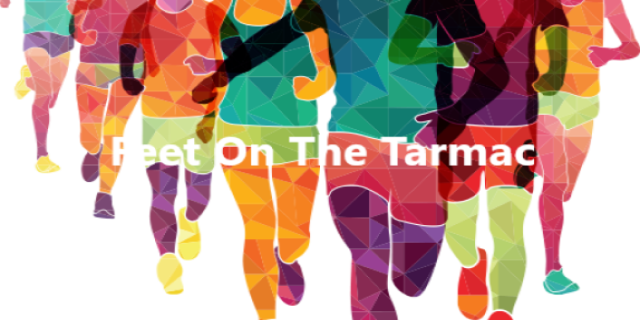

# Feet On The Tarmac - Registration


## Table of contents
* [General info](#general-info)
* [Technologies](#technologies)
* [Setup](#setup)

## General info
This is "Feet On The Tarmac" registration project. It is responsible for register competitions to the competition.
	
## Technologies
Project is created with:
* C#
* .NET 7
* Entity Framework Core
* PostgreSQL
* Azure Service Bus
* Azure Application Insights

## Setup
To run this project:
* Build the project

```
dotnet build Bz.Fott.Registration.csproj
```

* Start application

```
dotnet run Bz.Fott.Registration.csproj
```
